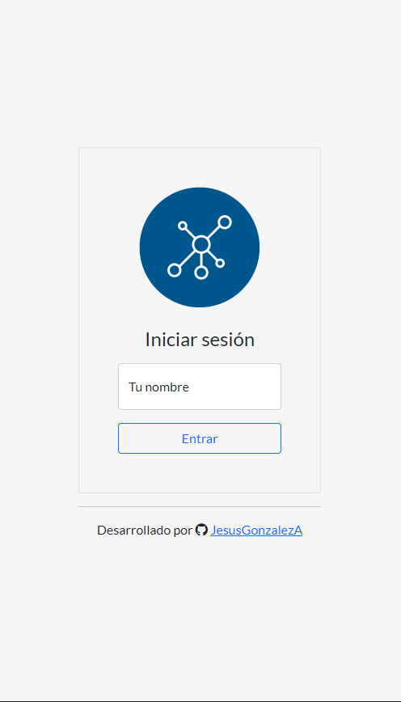
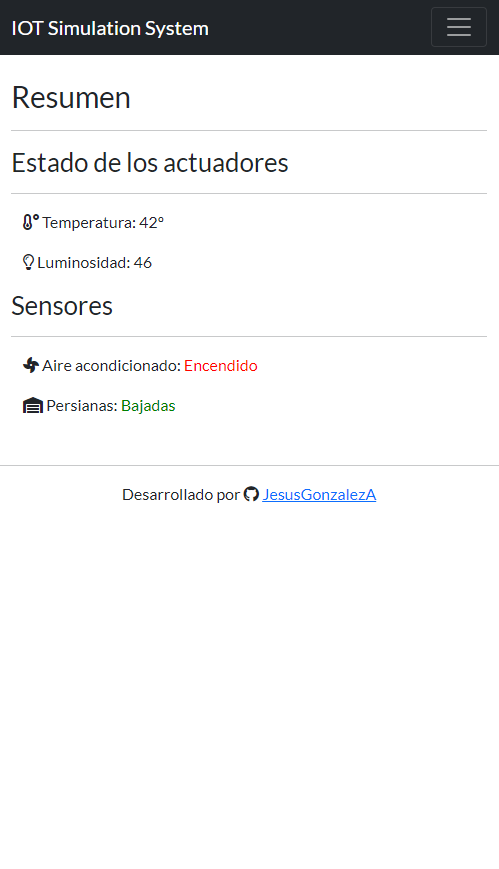
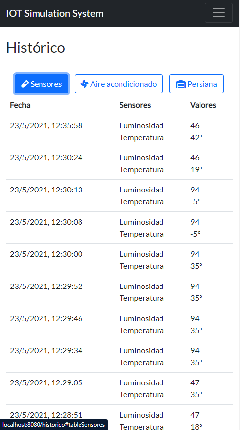
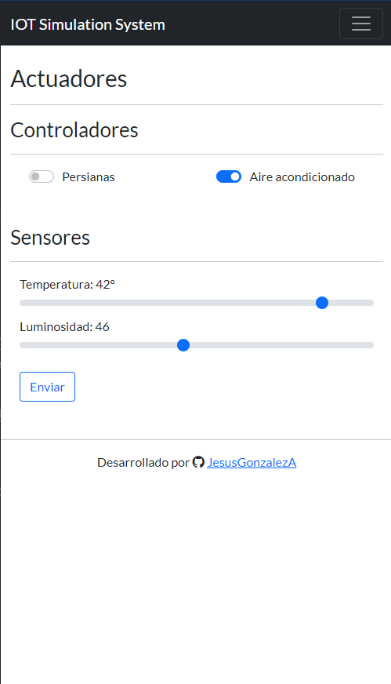
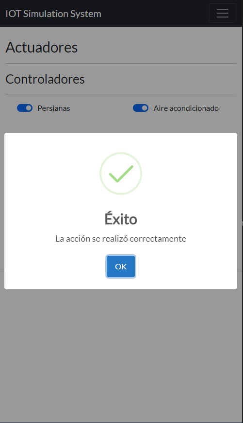

# IOT Simulation System

## Execution 
[ Video on youtube ](https://youtu.be/TF9Tz7XHR9s )

## Description
Real-Time application to control your house state. It simulates how an IOT System app works. 

## Analysis of the system
- [Client](https://github.com/JesusGonzalezA/IOT_System_Simulator/tree/main/public) : web page to interact with the system. Pages:
    - Summary: overview of the system. Real-Time values of:
        - Temperature
        - Luminosity
        - Air-conditioning's state
        - Blinds' state
    - History: last values and date
    - Actuators: here the user can turn on/off the air-conditioning and blinds as well as modify the state of the system ( temperature and luminosity )
- [Server](https://github.com/JesusGonzalezA/IOT_System_Simulator/tree/main/src) : it saves the system's updates on a database and notifies to all the clients the new modifications. It is composed of:    
    - HttpServer: in order to serve all the archives to the client and respond to new form's submissions.
    - DBServer: in order to save the state of the system.
    - SocketServer: to make the system works on real-time.
- [Agent](https://github.com/JesusGonzalezA/IOT_System_Simulator/tree/main/src/services): it checks whether a new update of the system should change the state of the air-conditioning and blinds.

## Installation 
### Requirements
- MongoDB running
- NPM
- Nodejs
- Internet connection

### Install
```
npm install
```

## Execution

Test mode
```
npm run dev
```

Publish mode
```
npm run start
```

## Pages






## Tools
- Client
    - Html
    - Bootstrap 5
    - Javascript
    - SweetAlert2
- Server
    - Node js
    - MongoDB
    - Socket-io

## Documentation
You can see the full documentation ( diagrams ) [here](https://github.com/JesusGonzalezA/IOT_System_Simulator/tree/main/doc)

Also explained ( Spanish ) [here](https://github.com/JesusGonzalezA/IOT_System_Simulator/tree/main/doc/Memoria.pdf) 